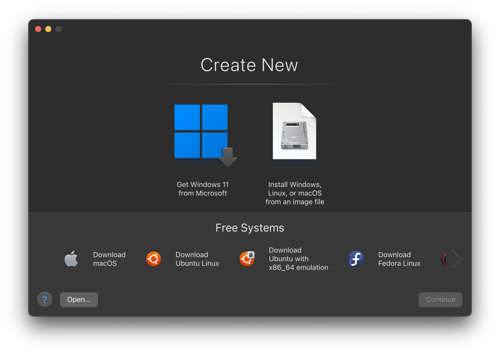
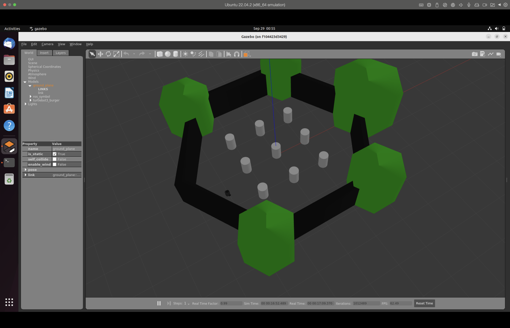

# ROS and Rocker: Turtlebot3

This repository contains the Dockerfile for the turtlebot3 simulation, using [Rocker](https://github.com/osrf/rocker) (Docker tool) and the docker base image `noetic-desktop-full`.

## Ubuntu 22.04 LTS ##

(Pending)

## Mac OS (M1/M2 chip) ##

Disclaimer: This process require to run with parallels desktop app. I'm not receiving any compensation for this recommendation. I just found it very useful for my work. If you have a better solution, I will be happy to hear it.

1. Install [parallels desktop](https://www.parallels.com/products/desktop/).

2. Install Ubuntu 22.04 LTS VM as follows:
    - Once parallels is installed, click on the "+" sign on the top right corner of the window and select "Install Windows or another OS from a DVD or image file".
    - Select Ubuntu with x86_64 emulation.
    
    - Proceed with the installation. Then Click on Download.

3. Wait until parallels finishes installing Ubuntu. Once it is done, you should set a password for the user "parallels" and then log in.

4. Validate if docker is installed:
    Parallels comes with docker pre-installed. To validate if it is installed, open a terminal and run the following command:
    ```
    $ docker --version
    ```
    If it is not installed, you can install it as follows:
    ```
    $ sudo apt update && sudo apt install curl
    $ curl -fsSL https://get.docker.com -o get-docker.sh
    $ sudo sh get-docker.sh
    ```
5. Add the user to the docker group:
    ```
    $ sudo usermod -aG docker $USER
    $ sudo newgrp docker
    ```

6. Configure Rocker:
    - First ensure that the Ubuntu Universe repository is enabled.
        ```
        $ sudo apt update
        $ sudo apt install software-properties-common
        $ sudo add-apt-repository universe
        ```
    - Now add the ROS 2 GPG key with apt.
        ```
        $ sudo apt update && curl -sSL https://raw.githubusercontent.com/ros/rosdistro/master/ros.key -o /usr/share/keyrings/ros-archive-keyring.gpg
        ```
    - Then add the repository to your sources list.
        ```
        echo "deb [arch=$(dpkg --print-architecture) signed-by=/usr/share/keyrings/ros-archive-keyring.gpg] http://packages.ros.org/ros2/ubuntu $(. /etc/os-release && echo $UBUNTU_CODENAME) main" | sudo tee /etc/apt/sources.list.d/ros2.list > /dev/null
        ```

    - And install rocker: 
        ```
        $ sudo apt-get install python3-rocker
        ```

7. Get source code:
    - Clone this repository in a specific path:
        ```
        $ git clone https://github.com/aldajo92/ROS_Rocker_Turtlebot3SimNoetic.git
        ```
    - Get submodules:
        ```
        $ cd ROS_Rocker_Turtlebot3SimNoetic
        $ git submodule update --init --recursive
        ```

8. Build and execute the docker image:
    ```
    $ ./scripts/build.sh
    $ ./scripts/run.sh
    ```

You should see somethin like follows:


The above image has a configuration in the OS for the display with a resolution 2048x1152(16:9).


## Autor ##
Alejandro Daniel Jose Gómez Flórez - @aldajo92
